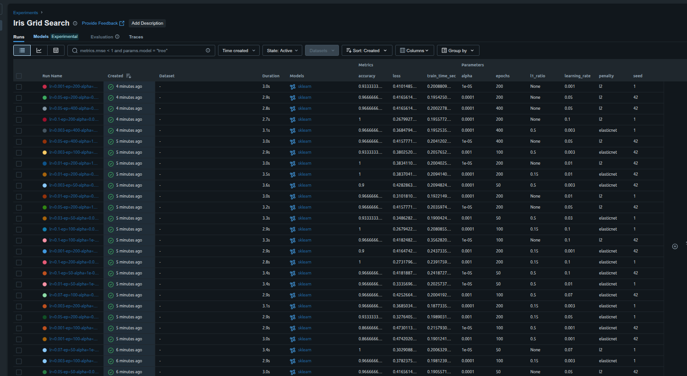
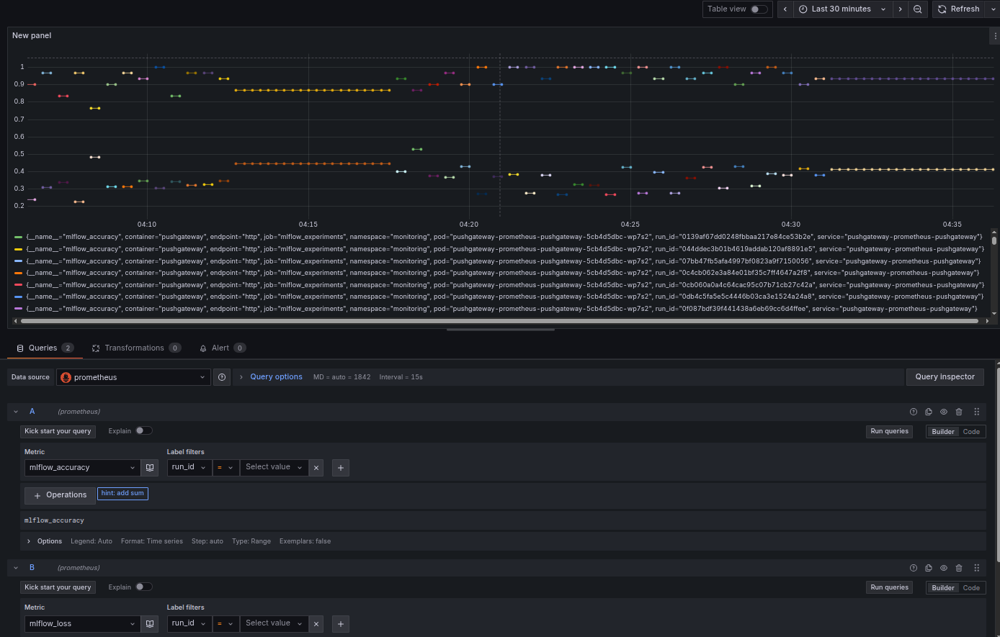
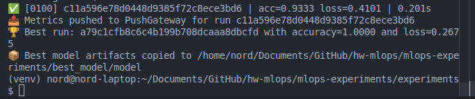

# Terraform AWS VPC and EKS Infrastructure

This project provisions a complete environment on AWS using Terraform. It includes a backend for storing state in S3 with DynamoDB locking, a VPC network, an EKS cluster, and an ArgoCD installation for GitOps deployments.

## Preparation

1. Install Terraform (>=1.6), AWS CLI and kubectl.
2. Configure AWS credentials (profile or environment variables).
3. Copy `terraform.tfvars.example` to `terraform.tfvars` and adjust variables.

## 1. Initialize terraform

```bash
terraform init -reconfigure
terraform fmt
terraform validate
terraform plan
```

## 2. Create terraform state

```bash
terraform apply -auto-approve
```

## 3. Access the cluster

```bash
aws eks update-kubeconfig --region eu-central-1 --name $(terraform output -raw cluster_name)
kubectl get nodes
kubectl get pods --all-namespaces
```

## 4. Deploy ArgoCD

```bash
cd ./agrocd
terraform init -reconfigure
terraform fmt -check
terraform validate
# terraform plan -var-file=../terraform.tfvars
terraform apply -auto-approve -var-file=../terraform.tfvars
kubectl get pods -n infra-tools
```

## 5. Open ArgoCD UI

Open <http://localhost:8080> in your browser.

```bash
cd ../
kubectl -n infra-tools port-forward svc/argocd-server 8080:443
```

Log in with user `admin` and the password fetched via:

```bash
kubectl -n infra-tools get secret argocd-initial-admin-secret -o jsonpath="{.data.password}" | base64 -d
```

## 6. Bootstrap the ML Ops stack via ArgoCD

Apply the application-of-applications manifest from this repository. It points ArgoCD at the `mlops-experiments/argocd/applications/` directory so every component manifest committed there becomes part of the stack automatically.

```bash
kubectl apply -f application/mlflow-application.yaml
```

## 7. Confirm ArgoCD synchronization

After the `mlops-stack` application is created, ArgoCD automatically deploys the child applications `minio`, `mlflow-postgres`, `mlflow`, and `pushgateway`. Track their status through the UI or by running:

```bash
kubectl get applications -n infra-tools
```

Proceed to the next steps only after every application reports the `Healthy/Synced` state.

## 8. Verify pod and service health

Once synchronization is complete, make sure each component is ready:

```bash
kubectl get pods -n application
kubectl get pods -n monitoring
kubectl get svc -n application
kubectl get svc -n monitoring
```

All applications should remain in the `Healthy/Synced` state in ArgoCD.

## 9. Set up port-forwarding for MLflow, MinIO, and PushGateway

Open the required services locally before running experiments:

MLflow Tracking UI <http://localhost:5000>

```bash
kubectl -n application port-forward svc/mlflow 5000:5000
```

MinIO S3 endpoint <http://localhost:9000>

```bash
kubectl -n application port-forward svc/minio 9000:9000
```

MinIO S3 UI <http://localhost:9001>

```bash
kubectl -n application port-forward svc/minio 9001:9001
```

Prometheus PushGateway <http://localhost:9091>

```bash
kubectl -n monitoring port-forward svc/pushgateway-prometheus-pushgateway 9091:9091
```

Prometheus UI <http://localhost:9090>

```bash
kubectl -n monitoring port-forward svc/kube-prometheus-stack-prometheus 9090:9090
```

Grafana UI <http://localhost:3000>

```bash
kubectl -n monitoring port-forward svc/grafana 3000:80
```

Grafana admin password

```bash
kubectl get secret grafana -n monitoring -o jsonpath="{.data.admin-password}" | base64 -d
```

## 10. Prepare the local environment for experiments

```bash
cd mlops-experiments/experiments
python3 -m venv venv
source venv/bin/activate
pip install -r requirements.txt
```

Create a `.env` file next to `train_and_push.py`.

## 11. Run `train_and_push.py`

1. Verify that the port-forward sessions are still active.
2. Start the experiment:

```bash
python train_and_push.py
```

The script runs several training cycles with different hyperparameters, logs them to MLflow, pushes the `mlflow_accuracy` and `mlflow_loss` metrics to PushGateway, and copies the best-performing model into `mlops-experiments/best_model/`.

## 12. Review results in MLflow and Grafana

- MLflow UI: open <http://localhost:5000> and locate the **Iris Grid Search** experiment.
- Grafana -> Explore -> Prometheus: query `mlflow_accuracy` and `mlflow_loss` to view the metrics labeled with `run_id`.

Interface screenshots:




## 13. Run additional checks

```bash
kubectl get events -n application --sort-by=.metadata.creationTimestamp | tail
kubectl -n monitoring exec deploy/pushgateway-prometheus-pushgateway --   wget -qO- http://localhost:9091/metrics | grep mlflow
```

## 14. Destroy infrastructure

```bash
terraform destroy -auto-approve
```
